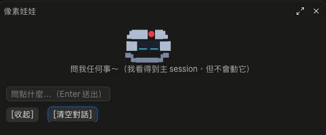

# claude-mod-sidebot（嗶嗶）

一個 Claude Code mod：**嗶嗶（Sidebot）**，住在側邊的像素機器人，也是你的 **sidecar 旁路小助手**。在側邊開一個聊天小窗，問名詞解釋、概念、剛剛那個錯誤是什麼意思之類，不想在主 session 問的事。它看得到主 session 的內容，但不會動它、也不會干擾它。支援桌面版（Code 分頁）與終端機。



## 使用說明

1. **安裝**（見下方），開新 session。
2. 新 session 一開始小窗就會自動開在側邊（不搶輸入焦點；視窗太窄時會等到夠寬才顯示）。關掉後輸入 `/buddy` 叫回來，輸入框會自動取得焦點。
3. 打字，按 Enter 送出。送出後輸入框自動清空，機器人開始「敲鍵盤」回答。
4. 回覆下方的 `[複製]` 可以複製整則回覆。
5. `[收起]` 關閉小窗（對話會保留，再 `/buddy` 就回來）；`[清空對話]` 清掉這個 session 的對話。

### 機器人的動作

| 狀態 | 時機 | 動作 |
|---|---|---|
| 閒晃 | 平常 | 原地左右看、偶爾眨眼、天線閃爍 |
| 思考 | 你在輸入框打字時 | 旁邊冒出 `·` `··` `···` 的泡泡 |
| 敲鍵盤 | 送出後、等回答的期間 | 眼睛往下看，兩隻手在鍵盤上輪流敲 |

### Sidecar 怎麼運作

- 回答時用 `$.model.fork`，把主 session 目前的對話複製一份當背景，再接上你在小窗的問題。唯讀，不會寫回主 session，所以小窗的問答不會出現在主 session，也不會打斷它正在做的事。
- 小窗自己最近 20 則對話會一起帶進去，可以連續追問。
- 主 session 還沒有任何回覆（或剛 `/clear`）時，會退回沒有背景的一般回答，並在回覆前註明。
- 回覆文字使用主題色，會跟著深淺色主題調整。

### 對話記憶

- 對話存在這個 session 裡：關掉小窗再打開、甚至 mod 重新載入，都還在（最多 100 則，畫面顯示最近 30 則）。
- **不跨 session**：開新 session 就是全新的對話，什麼都不會帶過去。

## 安裝

```bash
git clone https://github.com/monowu/claude-mod-sidebot.git
```

把資料夾加進 `~/.claude/settings.json` 的 `CLAUDE_CODE_PLUGIN_DIRS`（多個路徑用冒號分隔）：

```json
{
  "env": {
    "CLAUDE_CODE_PLUGIN_DIRS": "/path/to/claude-mod-sidebot"
  }
}
```

環境變數只在 session 啟動時讀取，所以要**開新 session** 才會生效。也可以單次載入：`claude --plugin-dir /path/to/claude-mod-sidebot`。

## 注意事項

- **費用與速度**：sidecar 每次回答都會把主 session 的內容送去模型。快取有效時很便宜；快取過期，或用 `/model` 切換模型後，會重新計費整段背景。回答用的是主 session 的模型，不是小模型，所以比一般小問題慢一些。
- **隱私**：主 session 的內容（包含你貼過的程式碼、檔案內容）會被當背景送給模型，與主 session 本身送出的內容相同，沒有送到別處。
- **唯讀**：fork 禁止所有工具，小助手不會讀寫檔案、執行指令，也不會改變主 session。它只靠提示詞被要求「只回答、不動手」。
- **回答可能過時**：背景是送出當下主 session 已經完成的內容；主 session 正在進行、還沒結束的那一步它看不到。
- **版面限制**：Claude Code 的 mod API 沒有浮層與拖曳事件，所以放在側邊 pane（可拖動 pane 寬度），不能自由拖曳。
- **複製**：回覆文字不能直接用滑鼠選取，請用 `[複製]` 按鈕。
- **打字偵測**：「思考」動畫是靠你每次按鍵偵測，最後一次按鍵 1.5 秒後恢復閒晃。

## 結構

```
.claude-plugin/plugin.json   外掛資訊
hooks/hooks.json             指向 register.tsx
hooks/register.tsx           全部邏輯與像素畫
types/index.d.ts             $.state 型別
docs/screenshot.png          截圖
```

## 授權

MIT
